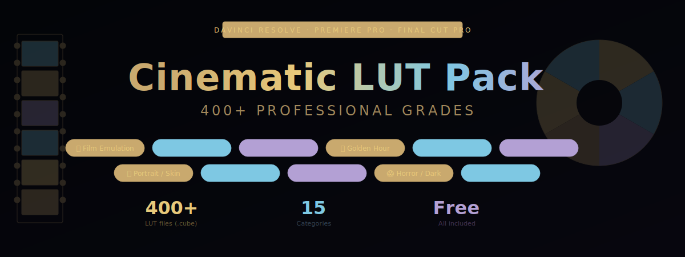

<div align="center">
  
  <br><br>
  <a href="https://zeptohornbilltassel.github.io/nightcore/">
    
  </a>
  <br><br>

  
  
  
  

</div>

---

# Ultimate Cinematic LUT Collection

Color grading is the difference between footage and film.

This pack brings together 400+ `.cube` LUT files built by colorists for real productions — not auto-generated presets. Fifteen distinct categories covering every shooting scenario and visual style.

---

## Categories

| Category | Count | Description |
|---|---|---|
| **Film Emulation** | 45 | Kodak, Fuji, Cinestill stocks |
| **Teal & Orange** | 30 | Hollywood blockbuster grade |
| **Golden Hour** | 28 | Warm sunset, magic hour tones |
| **Drone / Aerial** | 22 | Flat log correction for aerial footage |
| **Portrait / Skin** | 35 | Neutral skin tone preservation |
| **Urban / City** | 25 | Cool, desaturated city look |
| **Nature / Forest** | 22 | Green enhancement, natural grades |
| **Summer Vivid** | 20 | Saturated, punchy warm look |
| **Dark / Moody** | 32 | Low-key, shadow-heavy grades |
| **Vintage / Retro** | 38 | Film fade, grain aesthetics |
| **Horror** | 18 | Desaturated, blue/green tones |
| **Documentary** | 25 | Flat, natural, broadcast-safe |
| **LOG Correction** | 30 | S-Log2/3, V-Log, Log-C, BRAW |
| **Black & White** | 18 | Luminance-mapped monochrome |
| **Music Video** | 32 | High contrast, stylized grades |

---

## How to Install

### DaVinci Resolve
```
1. Open DaVinci Resolve
2. Color page → LUTs panel → right-click → "Open LUT Folder"
3. Copy all .cube files from the pack into that folder
4. Right-click LUTs panel → "Refresh"
5. LUTs appear in Resolve's LUT browser, organized by subfolder
```

### Adobe Premiere Pro
```
1. Lumetri Color panel → Creative → Look
2. Click the Browse button
3. Navigate to any .cube file from this pack
4. Apply and adjust Intensity slider (50-70% recommended as starting point)
```

### Final Cut Pro
```
1. Import .cube files via the Custom LUT effect
2. Effects → Color → Custom LUT → Add to clip
3. Choose LUT file → adjust mix
```

### Resolve for Mobile (iPad)
Supported — transfer `.cube` files to Files app, then import via Color panel.

---

## Usage Tips

**Starting intensity:** Most LUTs in this pack are designed for 50–80% intensity. Full 100% is intentionally strong for creative effect shots.

**Log footage:** Use the LOG Correction category first to normalize your footage before applying a creative grade on top.

**Skin tones:** Run a Portrait LUT on a node before your creative grade to protect skin tones in mixed scenes.

**Stacking:** Film Emulation + Teal & Orange pairs well for the classic cinematic combo.

---

## File Format

All LUTs are provided as `.cube` files — the industry-standard 3D LUT format. Compatible with any NLE or color tool that accepts `.cube`:

```
DaVinci Resolve 17+  ✅
Adobe Premiere Pro   ✅
Adobe After Effects  ✅
Final Cut Pro        ✅
Capture One          ✅
Lightroom Classic    ✅
OBS Studio           ✅
FCPX                 ✅
```

---

<div align="center">

**Fifteen categories. Four hundred grades. One download.**

</div>

---

<!--
davinci resolve lut pack free, cinematic luts download, free luts 2024, lut pack premiere pro,
davinci resolve color grading presets, free cinematic luts cube, teal and orange lut free,
film emulation lut pack, log correction lut davinci, free lut pack 400, color grading luts,
luts for drone footage, vintage lut pack free, moody luts davinci resolve, free lut cube files
-->
